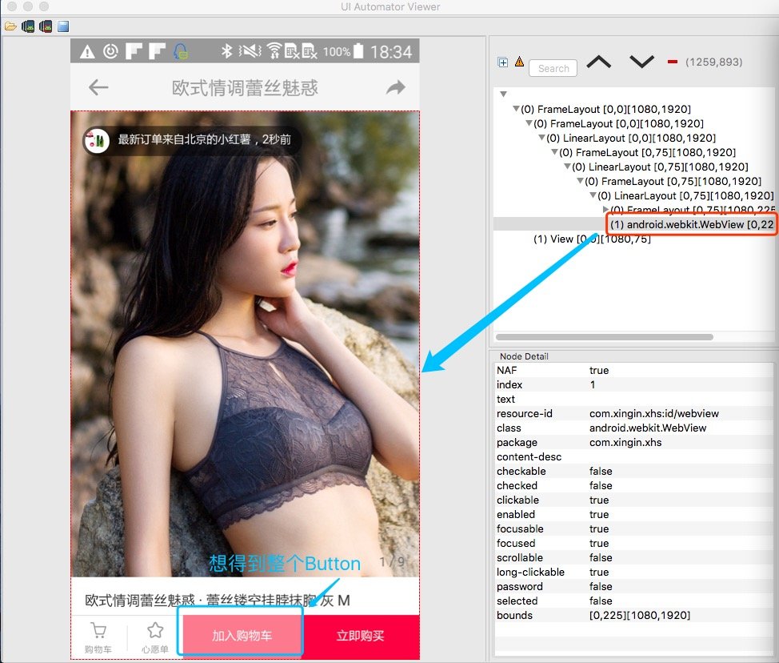
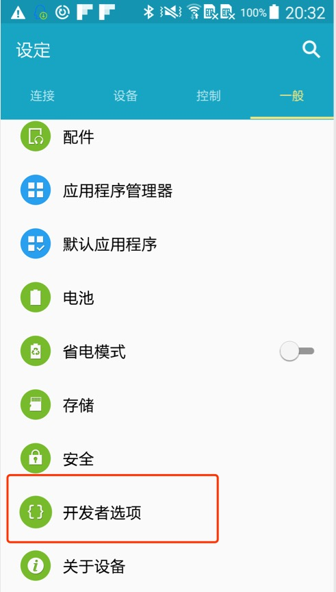
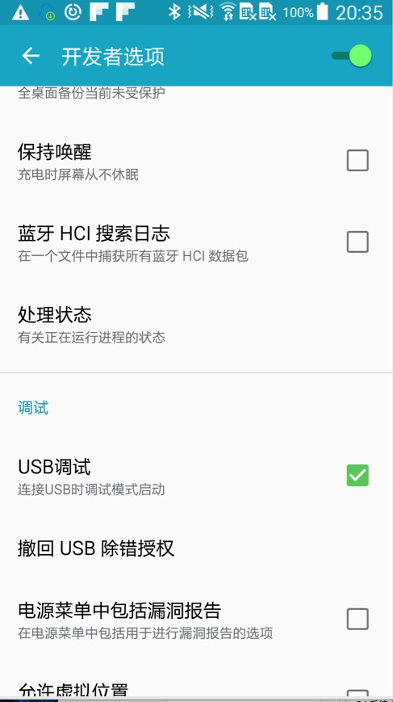
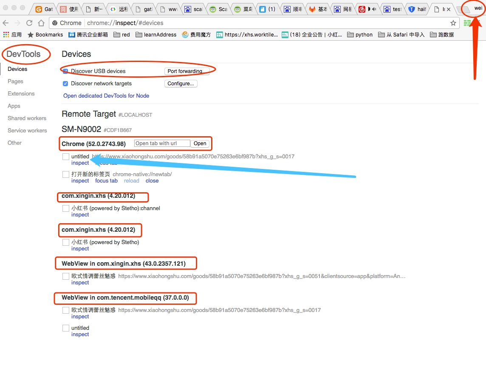
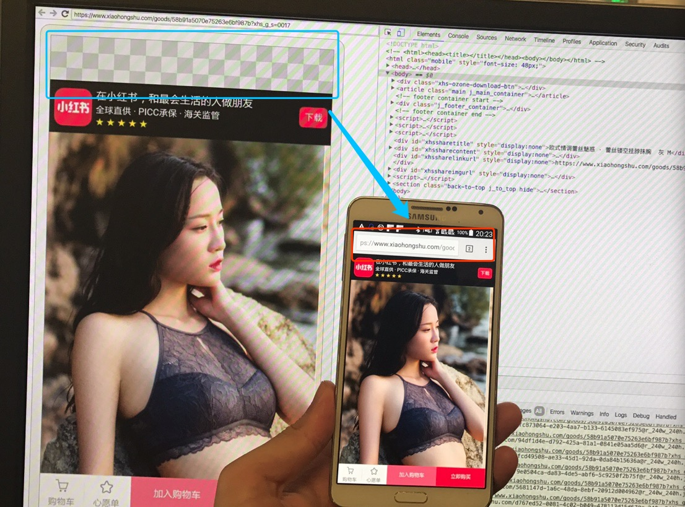

#移动自动化UI Hybrid-H5之Android的WebView测试#

Author：Juan Liu（XiaoHongshu Intern）  Date: 2017/05/05

## 相关背景
小红薯移动UI自动化框架Cartier开发完成了主要功能的之后，QA团队想尝试利用之前编写的UI自动化框架Cartier做一些固定流程的自动化（之前的流程是NATIVE），在做的过程中一些流程会涉及到关于WebView（H5）的控件获取、事件的产生和页面。这也是我第一次接触到这个混合的自动化，因此，下面把自己如何一步一步去写一个Python的Hybrid case的过程与大家分享一下，同时也希望和大家进行讨论、学习（毕竟第一次使用，会踩到不少坑，也肯定有许多不足。）

## 主要流程
主要分为以下两个步骤。
1. 获取到一个界面中webview下面的元素。
2. 通过本地的usb方式用python编写一个case，在该case下可以进行NATIVE_APP和WEBVIEW的切换。

## 获取webview下的元素
### 问题1-->直接使用uiautomatorviewer获取不到
如图所示，想获取小红书中某一个商品详情页下面的加入购物车按钮，如果用uiautomatorviewer，只能看到图中一个webview控件，对应左面的就是整体的部分，而我们期望得到的是“加入购物车”的内容。

如果想在uiautomatorviewer中看到下面的元素。
需要做一些额外的工作，具体怎么做我忘了，步骤比较烦。

### 问题2-->如何远程调控调试 WebView

这个还是比较重要的一部分，但是新手一开始不知道怎么做，这里有一篇比较好的文章，希望大家可以认真读一下。
[远程调试 Android 设备使用入门] (https://developers.google.com/web/tools/chrome-devtools/remote-debugging/)

如果你不想看原文，这里也可以看，不过非常建议看原文，原文有图。

####要求
1. 计算机上和andriod设备上已经安装了Chrome。
2. Andriod的版本是4.0 以上
3. 将android设备和计算机通过usb连接。

####第 1 步：发现您的 Android 设备
1. 在您的 Android 设备上，选择 Settings > Developer Options > Enable USB Debugging。 在运行 Android 4.2 及更新版本的设备上，Developer options 默认情况下处于隐藏状态。 请参阅启用设备上的开发者选项以了解如何启用它。

 勾选usb调试

2. 在您的开发计算机上打开 Chrome。您应使用您的一个 Google 帐户登录到 Chrome。 远程调试在隐身模式或访客模式下无法运行。（结合下图一起看）
3. 在 DevTools 中，点击 Main Menu 主菜单，然后选择 More tools > Remote devices。
4. 在 DevTools 中，点击 Settings 标签（如果正在显示另一个标签）。
5. 确保已启用 Discover USB devices。
6. 如果您尚未在 Android 设备上打开 Chrome，则现在打开它。
7. 返回 DevTools，点击与设备的型号名称匹配的标签。 在此页面的顶部，您会看到 Android 设备的型号名称，后面紧跟着其序列号。 在型号名称下面，您可以看到在设备上运行的 Chrome 的版本，版本号在括号里。每个打开的 Chrome 标签都会有自己的区域。您可以从此区域与该标签交互。 如果有任何使用 WebView 的应用，您也会看到针对每个应用的区域。
8. 在 New tab 旁输入一个网址，然后点击 Open。此页面将在 Android 设备上的新标签中打开
9. 点击您刚刚打开的网址旁的 Inspect。这将打开一个新的 DevTools 实例。 您的 Android 设备上运行的 Chrome 的版本决定在开发计算机上打开的 DevTools 的版本。因此，如果您的 Android 设备正在运行一个非常旧的 Chrome 版本，则 DevTools 实例看上去可能与您常用的实例有很大的差别。

####最后的结果

最后我们就可以看正常网页一下调试这个网页了。

### 问题3-->python如何从NATIVE_APP 切换到 WEBVIEW.****
	
在APPIUM hybird的官网上，看到如下Python代码。如果，你实际上在代码中使用是不可以的（这可能是伪代码？），需要自己进行去看Selenium的方法。
但是官网给的步骤是和规范的，第一步，获取你想切换到的环境（WEBVIEW开头的）。第二步，使用driver的switch_to方法进行切换。第三步，获取所要的元素，并操作。

~~~
# python
# assuming we have an initialized `driver` object for an app

# switch to webview
webview = driver.contexts.last
driver.switch_to.context(webview)

# do some webby stuff
driver.find_element(:css, ".green_button").click

# switch back to native view
driver.switch_to.context(driver.contexts.first)

# do more native testing if we want

driver.quit()
~~~

我自己简单改写的代码。

~~~

def switch_context(driver, context="WEBVIEW_***"):
    """
        1：环境不同，Native->To->Webview  or Webview->to->Native
        2：如果环境相同则不切换
    """
    contexts = driver.contexts
    if context in contexts:
        logger.info(u"切换到相应的环境下面")
        driver.switch_to.context(context)
        return True
    else:
        logger.error(u"没有切换到相应的环境下面，当前的环境为" + str(driver.context))
        return False
~~~

### 问题3-1-->按照如上方法，还是切换不到相应的环境怎么办？

我所遇到的问题大概存在以下几种情况：

1： 需要你所调试的app中的一个开关打开，这非常重要！！！否则，你只能得到NATIVE_APP

		setWebContentsDebuggingEnabled = True [这个需要找开发给你打包一个这个地方设置为True的包]
 
2: 在形成一个Des的时候要设置recreateChromeDriverSessions 为true

		@pytest.fixture(scope="session")
		def desired_one_cap(request):
    		"""用于测试手机的效果"""
		    desired_caps = {}
		    desired_caps['platformName'] = 'Android'
		    desired_caps['platformVersion'] = '5.0'
		    desired_caps['app'] = '...'
		    desired_caps['deviceName'] = '....'
		    desired_caps['newCommandTimeout'] = 120
		    desired_caps['unicodeKeyboard'] = True
		    desired_caps['resetKeyboard'] = True
		    desired_caps['noReset'] = False
		    desired_caps['recreateChromeDriverSessions'] = True
		    return desired_caps

3： 版本不对应，在实际的过程中，chromedirver 和chrome是有对应的。

| chromedriver版本| 支持的Chrome版本| 
| ------| ------ | 
|v2.29	|v56-58|
|v2.28	|v55-57|
|v2.27	|v54-56|
|v2.26	|v53-55|
|v2.25	|v53-55|
|v2.24	|v52-54|
|v2.23	|v51-53|
|v2.22	|v49-52|
|v2.21 |v46-50|
|v2.20	|v43-48|
|v2.19	|v43-47|
|v2.18	|v43-46|
|v2.17	|v42-43|

如果版本不对应，则需要进行相应的对应。这里基本的方法就是修改appium中原有的chromedriver。

### 问题4 可以切换到WEBVIEW下，但是不能经常会遇到No Such Session问题

这个情况很复杂，[Appium官网也有解决方法。](https://github.com/appium/appium/issues/6634)
这里我给出我解决的方法。

我的设备情况，可以从前面看到。我手机上的Chrome是V52，计算机是64位的58.0.3029.110 (64-bit)。
由于官网上和百度到的所有并没有解决我的问题，我就仔细读了Appium上所有的代码，最后发现是因为，早早地把proxy关了。

个人理解的原理是： 从NATIVE到WEBVIEW的过程中，会和原来的session不一致，这个时候appium会启动一个转换机制，这样在NATIVE和WEBVIEW环境下都可以拥有自己的session。但是appium最后只认可一个（NATIVE）。
一旦这个转换机制早早地关了，就会导致一个session appium不认可。这个时候，如果在用这个session去作一些动作，显然会出现NO SUCH SESSION的问题。

解决方法：
降级APPIUM中的Chromedriver
这个我查的时候，官网给出的是升级，因为对许多版本，协议没有非常清楚，最后只能降级试试，反而成功解决了。可能还是对应的问题。

## 总结
遇到问题，可以去google，appium和stackoverflow上查一下，国内的话，testerhome上还是有不少好的学习资料。
Hybird 自动化测试，随着H5的继续发展，肯定也会得到各个公司的认可。

## 问题 
感觉自己在再闭门造车，想知道实际中各个公司，遇到hybrid怎么办？希望看到的兄弟姐妹能给个建议，一起讨论。
