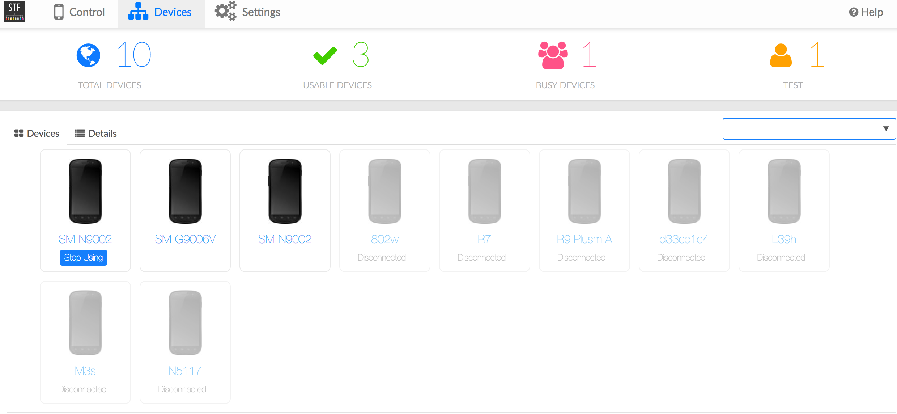
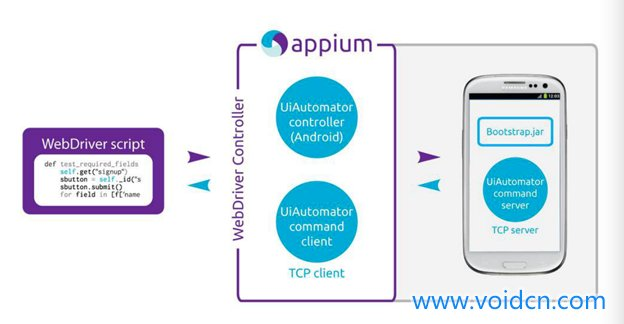
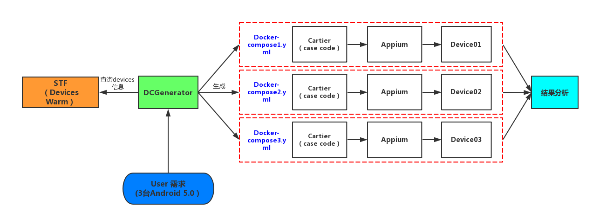
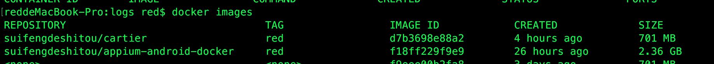

# 移动自动化测试框架Cartier介绍
Author：Juan Liu  Date: 2017/03/03

## 相关背景
目前国内许多公司都开始使用自动化测试，尤其是最近这几年，自动化测试更是受到了越来越多的青睐。常见公司产品的商业化，使其不可能做到一个产品结构的经常变动的。这就给自动化技术提供了基础。常见的自动化测试包括客户端和移动端，本文旨在讨论移动端的测试化，包含小红书使用自动化的相关介绍。目前常见的移动自动化测试，主要分布在以下三个层面，UI层面、接口层面和单元测试。

虽然移动化测试能提高测试团队的测试效率，但也只是在特定场景下可以使用，是不可能替代人工测试的，只是一个辅助的工具。

## 使用原因
这个主要根据公司的产品和公司的发展来定。目前来说，由于小红书的APP相关流程的固定性（比如，发送笔记等），是可以找到移动化测试的应用场景的。此外，从现在开始积累一些自动化测试方面的知识，对于公司的成长是有帮助的。总的来说，还是投入产出比，毕竟，公司是看利益的地方。因此，小红书开始也是找实习生来尝试这个事情，这样可以达到投入成本比较低。

## 相关技术
### STF
个人觉着是提供一个移动端的资源池，通过RESTFUL框架我们可以获取所学要的移动端设备，是一个比较好的移动端设备管理工具。目前官网上说可以管理多达1000台手机。示例图如下。

每个移动端的设备的信息会以JSON格式进行显示。[STF官网。](https://github.com/openstf/stf)
<pre>
<code>{
      "abi": "armeabi-v7a",
      "airplaneMode": false,
      "browser": {
        "apps": [
          {
            "id": "com.sec.android.app.sbrowser/.SBrowserMainActivity",
            "name": "Browser",
            "selected": true,
            "system": true,
            "type": "samsung-sbrowser",
            "developer": "Samsung"
          }
        ],
        "selected": true
      },
      "manufacturer": "SAMSUNG",
      "model": "SM-N9002",
      "platform": "Android",
      "presenceChangedAt": "2017-03-02T07:23:21.848Z",
      "present": true,
      "product": "h3gduoszn",
      "provider": {
        "channel": "tYqz8OvsS9CR5XlOCrGV5w==",
        "name": "red-Inspiron-3647"
      },
      #...
      "ready": true,
      "remoteConnect": true,
      "remoteConnectUrl": "xx",
      "reverseForwards": [],
      "sdk": "21",
      "serial": "xx",
      "status": 3,
      "statusChangedAt": "2017-03-02T07:23:21.849Z",
      "version": "5.0",
      "using": true
    }
</code>
</pre>
### ADB
</img>
ADB是一个连接模拟器或者Android设备的多功能命令行工具，它是一个包含三个组件的C-S程序[Ellen007](http://www.jianshu.com/p/f360d06c1129)：

1. 客户端，运行在开发机器（电脑）上，你可以通过从shell输入adb命令来调用客户端，或者从其他Android工具如DDMS创建adb客户端。
2. 服务端，作为一个后台进程运行在开发机器（电脑）上，负责管理客户端和模拟器（设备）上的adb守护进程之间的通信。
3. 守护进程，作为后台进程运行在每个模拟机（设备）上。

你可以在sdk的platform-tools中找到adb工具。当你开启一个adb客户端，客户端首先检查是否有一个adb服务端已经在运行，如果没有，则启动服务端进程。当服务端启动时，它绑定到本地TCP端口5037来监听从adb客户端发送的命令，所有的adb客户端通过5037端口和服务端通信。

### Appium
Appium是一个开源的、跨平台的自动化测试工具，支持IOS、Android和FirefoxOS平台。 通过Appium，开发者无需重新编译app或者做任何调整，就可以测试移动应用，可以使测试代码访问后端API和数据库。它是通过驱动苹果的UIAutomation和Android的UiAutomator框架来实现的双平台支持，同时绑定了Selenium WebDriver用于老的Android平台测试。开发者可以使用WebDriver兼容的任何语言编写测试脚本，如Java， OC， JS， PHP，Python， Ruby， C#，Clojure 和Perl语言。
[Appium官网。](http://appium.io/)

IOS的Appium架构图 引用[appium架构原理](http://www.voidcn.com/blog/hqzxsc2006/article/p-5786773.html)
</img>

Android的Appium架构图
</img>

### Docker
Docker就是一个应用程序执行容器，类似虚拟机的概念。但是与虚拟化技术的不同点在于下面几点：

1. 虚拟化技术依赖物理CPU和内存，是硬件级别的；而docker构建在操作系统上，利用操作系统的containerization技术，所以docker甚至可以在虚拟机上运行。
2. 虚拟化系统一般都是指操作系统镜像，比较复杂，称为“系统”；而docker开源而且轻量，称为“容器”，单个容器适合部署少量应用，比如部署一个redis、一个memcached。
3. 传统的虚拟化技术使用快照来保存状态；而docker在保存状态上不仅更为轻便和低成本，而且引入了类似源代码管理机制，将容器的快照历史版本一一记录，切换成本很低。
4. 传统的虚拟化技术在构建系统的时候较为复杂，需要大量的人力；而docker可以通过Dockfile来构建整个容器，重启和构建速度很快。更重要的是Dockfile可以手动编写，这样应用程序开发人员可以通过发布Dockfile来指导系统环境和依赖，这样对于持续交付十分有利。
5. Dockerfile可以基于已经构建好的容器镜像，创建新容器。

Docker还有的优点包括，发布快、部署方便等。

### Python
Python优势的最大有点就是比其他语言更简单易学，功能强大的解释型编程语言，它有简洁明了的语法，高效率的高层数据结构，能够简单而有效地实现面向对象编程python的特点比较简单易学，有丰富的库。

## 未来愿景
小红薯的自动化测试架构的当前愿景是，利用自动化测试可以形成一个可配置的、开发成本低、学习成本低的、结果可视化的工具。主要是测试人员不需要了解整体的架构原理，只需要简单的UI配置就可以对一个case进行测试。例如，测试人员A想在3台Android 5.0以上的设备上测试一个功能，那么他只需要在一个界面简单的填上上面两个参数，点击启动即可。然后就可以在结果界面看到自己刚刚的执行结果。

未来的愿景是，可以集成接口测试，其他相关的测试。（根据需求来进行增加）。

## 目前进展
小红薯的移动自动化测试框架Cartier是由三个部分组成。
### Cartier的架构
</img>
简单的流程就是用户提出需求，DcGenerator从STF平台获取所需的设备，并生成各个Docker-compose文件以及启动这些文件。然后将最后的结果都保存在一个地方（目前来说通过docker-compose文件提供的volumes设置了文件映射到本地一个文件夹中，以后可能会连接相应的数据库。）这个结果以后会以html的形式展现出来，目前想利用的框架是Jenkins。

下面谈谈各个模块的功能和作用。
#### DCGenerator的功能
这个模块的功能主要是用来获取所需要的devices信息，主要利用的自己开发的选择工具（stf-selector）,并生成我们希望启动的设备的Docker-compose.yml文件，当然，启动也在这个模块。
<pre>
<code>version: '2'
services:
  appium:
    image: xx
    environment:
        - APK_NAME=xx
    ports:
        - xx
    command: xx
    volumes:
        - xx:xx
  cartier:
    image: xx
    volumes:
        - xx:xx
    links:
        - xx
    environment:
        - PLATFORM_VERSION=xx
        - APP_NAME=xx
        - DEVICES_NAME=xx
    command: xx</code>
</pre>
#### Cartier(case code)
这个镜像主要包含的是我们需要测试的用例，比如我们想测试一个create-note的过程，我们就需要些一个针对这个流程的case，对于一个熟练的人来说，写一个一般复杂的case估计需要半天左右。

    def test_run_one_create_note(self, appium_driver):
        """
        :param appium_driver:
        :return:
        """
        # time.sleep(5)
        if appium_driver is None:
            logger.info(u"所有的设备都在使用或者没有设备")
            return
        appium_driver = appium_driver
        logger.info('Test create note')
        login_action = LoginAction(appium_driver)
        logger.info("Begin to login")
        login_action.with_password_login_action(phone_number=PHONE_NUMBER, password=PASSWORD)
        logger.info('Begin to test upload pictures')
        upload_action = CreateNoteAction(appium_driver)
        upload_action.deliver_note_action()
        logger.info('End test the upload pictures')
        time.sleep(5)
#### Appium
这个镜像主要是封装了appium，因为之前在从docker hub上下载的appium-docker镜像出现了一些问题，所以这里自己做了一个镜像。主要是接受来自客户端的请求然后再转为adb命令跟devices沟通。

## 案列展示
下面我们通过一个例子来展示Cartier项目。
### 镜像
做了两个镜像，一个cartier（客户端）和一个appium，
一个Docker-compose.yml文件，用于连接这两个镜像，从而形成一个完成的流程。
### 结果展示
- 镜像文件
</img>

- Docker-compose文件
<pre><code>version: '2'
services:
  appium:
    image: suifengdeshitou/appium-android-docker:red
    environment:
  cartier:
    image: suifengdeshitou/cartier:red
    links:
        - appium
</code></pre>
- cartier的运行结果
</img>
- appium的运行结果
</img>

## 总结
以上是我之前两个月左右所做的一些工作。下面我来谈谈，我对移动自动化测试的看法。

移动端自动化测试目前处在一个开始阶段，但也是发展最迅速的阶段，而且一定是未来发展的必然趋势。

在当前学习自动化测试，尤其是自动化测试是每一个测试人员最好的时间。保持好嗅觉，才能立于不败之地。

